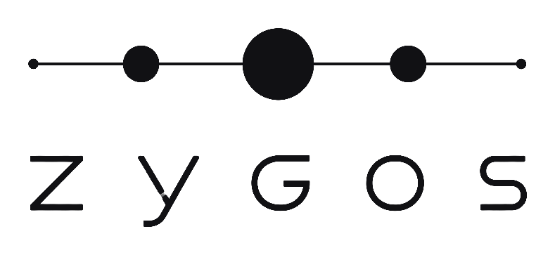

<p align="center">
  <picture>
    <source media="(prefers-color-scheme: dark)" srcset="assets/wordmark-dark.png">
    
  </picture>
</p>

<p align="center">
  <strong>One view over every tracker your work is scattered across.</strong>
</p>

<p align="center">
  <a href="https://github.com/Gabriel100201/zygos/releases/latest"></a>
  <a href="https://github.com/Gabriel100201/zygos/actions/workflows/ci.yml"></a>
  <a href="./LICENSE"></a>
  
</p>

---

Your tasks live in Linear. Your client's live in a self-hosted Taiga. That one
legacy project lives in OpenProject. Your coding agent can reach none of them.

Zygos is a single Go binary that speaks [MCP](https://modelcontextprotocol.io)
over stdio and gives any agent — Claude Code, Cursor, Cline, OpenCode — one
unified set of tools across all three. List, search, create, update and comment
on tasks, and read and write Linear documents, without leaving the terminal.

```
Agent (Claude Code / Cursor / Cline / OpenCode / any MCP client)
    | MCP stdio
Zygos (single Go binary)
    |
    +---> Linear GraphQL API (any number of workspaces)
    +---> Taiga REST API (any number of instances, self-hosted or cloud)
    +---> OpenProject REST API v3 (any number of instances, self-hosted or cloud)
```

<p align="center">
  
</p>

<sub><em>Zygos</em> (ζυγός) is the Greek for <em>yoke</em> — the beam that couples
several bodies so they pull as one. It is also the root of <em>syzygy</em>, the
alignment of three celestial bodies on a single line, which is what the mark
above draws.</sub>

## Features

- **Tasks across workspaces** — list, get, create, update, search issues from multiple Linear workspaces, Taiga instances, and OpenProject instances at once.
- **Linear documents CRUD** — read and write Linear docs (markdown) from your agent.
- **Team vs Project aware** — Linear's two-level hierarchy (teams + projects) is exposed correctly; filter tasks or docs by either.
- **Interactive CLI** — `zygos config add linear` / `add taiga` / `add openproject` walks you through setup, validates the connection, and writes the config for you.
- **Graceful degradation** — if one provider is unreachable (VPN down, etc.) the others still work; failures surface as warnings, not hard errors.
- **Single binary** — one Go executable, zero runtime dependencies.

## Quick start

Three steps. The whole thing takes about two minutes if you already have a Linear API key ready.

### 1. Install the binary

**With Go (simplest — always picks the latest release):**

```bash
go install github.com/Gabriel100201/zygos/cmd/zygos@latest
```

Make sure `$(go env GOPATH)/bin` — typically `~/go/bin` on Linux/macOS or `%USERPROFILE%\go\bin` on Windows — is on your `PATH`.

**Without Go:** download the archive for your OS from the [latest release](https://github.com/Gabriel100201/zygos/releases/latest), extract it, and put `zygos` (or `zygos.exe`) somewhere on your `PATH`. Full details and checksum verification in the [Install section](#install).

Verify:

```bash
zygos version
```

### 2. Add your first workspace

```bash
zygos config add linear
```

You'll be prompted for:

- A friendly name (e.g. `work`) — this is how you'll reference the workspace from agent tools
- Your Linear API key (input is hidden) — get one at **Linear → Settings → API → Personal API keys → Create key**

Zygos validates the key against Linear before saving. If it's valid, you'll see `✓ Connection OK` and the config is written to `~/.zygos/config.yaml` with mode `0600`.

Repeat `zygos config add linear` for every additional Linear workspace, or `zygos config add taiga` for a Taiga instance. Then verify everything works:

```bash
zygos config list   # shows all providers with secrets masked
zygos config test   # pings each provider
```

### 3. Connect to your AI agent

**Claude Code:**

```bash
claude mcp add --transport stdio zygos -- zygos mcp
```

Then reload the MCP connection inside Claude Code — run `/mcp` and reconnect `zygos` (or just restart the session). Claude Code picks up the 13 tools automatically.

**Cursor / Cline / Windsurf / any other MCP client:** add a stdio server with command `zygos` and args `["mcp"]` — see [Register with your AI agent](#register-with-your-ai-agent) for exact JSON snippets.

That's it — ask your agent "what do I have assigned in Linear today?" and it will call `tasks_list assigned=true` on its own.

## Install

### Option A — Download a pre-built binary (no Go needed)

Grab the archive for your OS and architecture from the [**latest release**](https://github.com/Gabriel100201/zygos/releases/latest):

- `zygos_<version>_linux_amd64.tar.gz`
- `zygos_<version>_linux_arm64.tar.gz`
- `zygos_<version>_darwin_amd64.tar.gz` — macOS Intel
- `zygos_<version>_darwin_arm64.tar.gz` — macOS Apple Silicon
- `zygos_<version>_windows_amd64.zip`

Extract the `zygos` (or `zygos.exe`) binary and put it somewhere on your `PATH`.

```bash
# example for Linux amd64
curl -sL https://github.com/Gabriel100201/zygos/releases/latest/download/zygos_<version>_linux_amd64.tar.gz | tar -xz
sudo mv zygos /usr/local/bin/
```

Each release also ships `checksums.txt` (SHA-256) so you can verify the download.

### Option B — `go install`

```bash
go install github.com/Gabriel100201/zygos/cmd/zygos@latest
```

The binary lands in `$(go env GOPATH)/bin` (typically `~/go/bin` on Unix, `%USERPROFILE%\go\bin` on Windows). Make sure that directory is on your `PATH`.

### Option C — Build from source

```bash
git clone https://github.com/Gabriel100201/zygos.git
cd zygos
go install ./cmd/zygos/
```

### Verify

```bash
zygos version
zygos help
```

## Quick start — interactive setup

The fastest path is the built-in CLI:

```bash
# Add a Linear workspace (prompts for a friendly name + API key; validates the key)
zygos config add linear

# Add a Taiga instance (prompts for URL + username + password; validates via auth)
zygos config add taiga

# Add an OpenProject instance (prompts for URL + API key; validates via /users/me)
zygos config add openproject

# Add as many as you want — e.g. multiple Linear workspaces for work and personal
zygos config add linear

# Inspect what's configured (secrets are masked)
zygos config list

# Verify every provider is reachable
zygos config test

# Remove one
zygos config remove <name>

# Print the config file path
zygos config path
```

The config is saved to `~/.zygos/config.yaml` (or `$ZYGOS_CONFIG` if set) with mode `0600` — owner read/write only — because it contains API keys and passwords.

## Manual configuration (optional)

If you prefer editing YAML by hand, copy [`config.example.yaml`](./config.example.yaml) to `~/.zygos/config.yaml` and fill it in:

```yaml
providers:
  - name: work           # any unique label — you'll use it to reference this provider
    type: linear
    api_key: "lin_api_..."

  - name: personal
    type: linear
    api_key: "lin_api_..."

  - name: team-taiga
    type: taiga
    url: "https://taiga.example.com"
    username: "myuser"
    password: "mypassword"

  - name: my-openproject
    type: openproject
    url: "https://openproject.example.com"
    api_key: "opapi-..."
```

| Field | Required for | Description |
|-------|-------------|-------------|
| `name` | all | Unique identifier — an arbitrary label you choose |
| `type` | all | `linear`, `taiga` or `openproject` |
| `api_key` | linear, openproject | Linear personal API key, or OpenProject API token (My account → Access tokens → API) |
| `url` | taiga, openproject | Base URL of the Taiga / OpenProject instance |
| `username` | taiga | Taiga username |
| `password` | taiga | Taiga password |

Override the config path with the `ZYGOS_CONFIG` environment variable.

## Register with your AI agent

### Claude Code

```bash
claude mcp add --transport stdio zygos -- zygos mcp
```

> **Windows gotcha:** `claude mcp add` with absolute paths can strip backslashes. Either use just `zygos` (if it's on your PATH), or after running the command verify the path in `~/.claude.json` has proper backslashes (`C:\\Users\\...`) and fix it manually if needed.

### OpenCode

Add to `~/.config/opencode/config.json`:

```json
{
  "mcpServers": {
    "zygos": {
      "command": "zygos",
      "args": ["mcp"]
    }
  }
}
```

### Any MCP client

Zygos uses **stdio** transport. Configure with:

- Command: `zygos` (or full path to the binary)
- Args: `["mcp"]`

## MCP Tools

### Tasks

| Tool | Read-only | Description |
|------|-----------|-------------|
| `tasks_list` | ✓ | List open tasks across all providers. By default returns **all** open tasks; set `assigned=true` to see only your own. |
| `tasks_get` | ✓ | Full detail of a task by identifier (description, comments, labels) |
| `tasks_create` | — | Create a task in a specific provider/project |
| `tasks_update` | — | Update status, title, priority, description |
| `tasks_search` | ✓ | Keyword search across titles and descriptions |
| `tasks_projects` | ✓ | List all teams and projects (Linear exposes both; Taiga and OpenProject only projects) |
| `tasks_states` | ✓ | List valid workflow states for a project (use before `tasks_update`) |

### Documents (Linear only)

| Tool | Read-only | Description |
|------|-----------|-------------|
| `docs_list` | ✓ | List Linear docs; filter by provider, project, or title substring. Project filter also accepts a team name (returns union across its projects). |
| `docs_get` | ✓ | Fetch a doc by slug or UUID — returns the full markdown body |
| `docs_create` | — | Create a doc inside a Linear project |
| `docs_update` | — | Update title, content, icon, or color |
| `docs_delete` | — (destructive) | Permanently delete a doc |
| `docs_search` | ✓ | Native Linear document search |

### Identifier format

- **Linear tasks:** issue key, e.g. `ABC-42`
- **Linear docs:** slugId (from URL) or UUID
- **Taiga user stories:** `<providerName>:us:<id>`, e.g. `work:us:234`
- **Taiga tasks:** `<providerName>:task:<id>`, e.g. `work:task:56`
- **OpenProject work packages:** `<providerName>:wp:<id>`, e.g. `work:wp:1234`

### Project model (Linear)

Linear has two levels:

- **Team** — e.g. name `"Acme"` with key `ACME`, groups all issues with prefix `ACME-xx`
- **Project** — e.g. `"Website Redesign"`, a logical grouping of issues inside a team

`tasks_projects` lists both, and the `Kind` column tells them apart. The `project` filter on `tasks_list` and `docs_list` matches either level — pass a team name/key to see everything in a team, or a project name to narrow down.

### OpenProject notes

- Tasks map to **work packages**; `tasks_create` defaults to the `Task` type (or the project's first type if none is named `Task`).
- Workflow statuses are defined **instance-wide** in OpenProject, so `tasks_states` returns the same set regardless of which project you pass.
- Documents are not supported (the `docs_*` tools apply to Linear only).

## Graceful degradation

If a provider is unreachable (e.g. Taiga behind a VPN that's disconnected), Zygos returns results from the healthy providers with a warning. It does not fail the whole call.

## Security

The config file contains API keys and passwords. Zygos writes it with permissions `0600` so only the owner can read it. On shared machines, make sure your home directory has appropriate protection.

Never commit your config to a public repository. This repo's `.gitignore` excludes `config.yaml` by default.

## Environment variables

| Variable | Description | Default |
|----------|-------------|---------|
| `ZYGOS_CONFIG` | Config file path | `~/.zygos/config.yaml` |
| `TABLERO_CONFIG` | Deprecated alias for `ZYGOS_CONFIG`, honoured when the former is unset | — |

## Migrating from Tablero

This project was called **Tablero** until v0.3.0. Nothing about how it works
changed — only the name.

Your existing setup keeps working untouched. Zygos reads `~/.tablero/config.yaml`
when `~/.zygos/config.yaml` does not exist, and still honours `TABLERO_CONFIG`,
so an install from before the rename needs no action.

To finish the move whenever it suits you:

```bash
# 1. Install the new binary
go install github.com/Gabriel100201/zygos/cmd/zygos@latest

# 2. Move the config to its new home (optional — the old path still resolves)
mv ~/.tablero ~/.zygos

# 3. Point your MCP client at the new command
#    "command": "tablero"  ->  "command": "zygos"

# 4. Drop the old binary
rm "$(command -v tablero)"
```

The GitHub repository was renamed in place, so `github.com/Gabriel100201/tablero`
redirects here and existing clones keep pushing and pulling normally. Update the
remote when convenient:

```bash
git remote set-url origin https://github.com/Gabriel100201/zygos.git
```

## Requirements

- **Go 1.25+** to build from source (the CLI depends on `golang.org/x/term` for hidden password prompts)
- No runtime dependencies

## Contributing

Bug reports, feature requests, and pull requests are welcome. See [`CONTRIBUTING.md`](./CONTRIBUTING.md) for the development setup, commit convention, and PR flow. Maintainers cutting a release should follow [`RELEASING.md`](./RELEASING.md).

## License

[MIT](./LICENSE)
